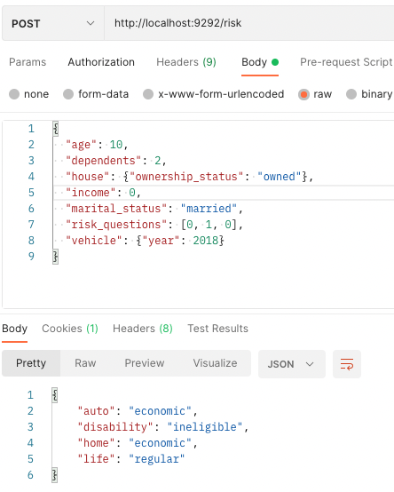
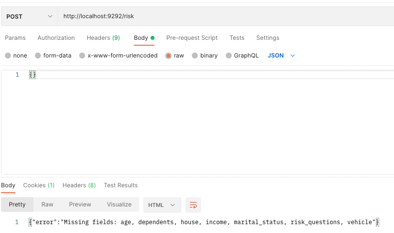
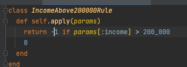
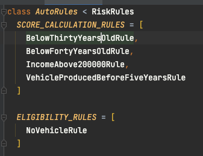
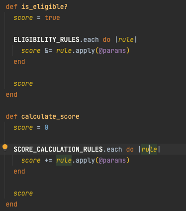

# risk-score-algorithm

# How to Run
- Install Ruby version 2.7.2 or higher
- Run `bundle install` to install dependencies
- To run the RSpec tests: run `rspec`
- To run the server: run `bundle exec rackup config.ru
`

# Server

The endpoint for this exercise: `(POST) http://localhost:9292/risk` 

## Request

```
{
  "age": 35,
  "dependents": 2,
  "house": {"ownership_status": "owned"},
  "income": 0,
  "marital_status": "married",
  "risk_questions": [0, 1, 0],
  "vehicle": {"year": 2018}
}
```


## Response


The application receives the JSON payload through the API endpoint and transforms it into a risk profile by calculating a risk score for each line of insurance (life, disability, home & auto) based on the information provided by the user.

This algorithm results in a final score for each line of insurance, which should be processed using the following ranges:

0 and below maps to “economic”.
1 and 2 maps to “regular”.
3 and above maps to “responsible”.

```
{
    "auto": "regular",
    "disability": "ineligible",
    "home": "economic",
    "life": "regular"
}
```



If no body (or missing fields) are sent, the application should return a 400 Bad Request response.



# Strategy

- I used the Sinatra library, Reck server and Ruby language, because i am more familiar with them.

- Architecture-wise, I decided not to add any complexity since this is an exercise focused on dealing with Business Rules. So a simple controller with a service layer was enough.

- Dependency is as follows: Controller -> Service classes -> Rules classes

- Files: 
  - The controller is on `app/api/risk.rb` 
  - The service with the rules is on `app/services/*.rb` 
  - The tests are on `spec` folder 
  
- I had a few options on how to implement this series of business rules (mainly a few design patterns), but in the end i decided to use something more simples that i had previously used: Each category is a class with an array of rules, which we will iterate over and apply the calculations. 
  


- The business rules are complex and should be extensible, so I decided to encapsulate each rule into a class



- Each Business Rule Class was then injected into a Insurance Category class:



- When calculating the score, the category class iterated over the Business Rule array applying the value (usually -1, 0 or +1) to the final score


- Ruby doesnt have interfaces, so I used Inheritance -- a Superclass called RiskRule that implements the `is_eligible?` and `calculate_score` methods. The subclasses will basically pick the rules that should apply to them (ex: No Income for Disability eligibility) and let the super class do the calculation



- This worked well because the rules applies the same score (eg. +1) independently of the insurance category. There was an exception (Marriage status added +1 to life and -1 to disability score), so it was treated by splitting the rule into two different classes


- To add new rules, you can simply add a new class with the rule to the `app/services/rules` folder, then inject the class name in the Category. 


- Unit and Integration tests for the business rules were written to ensure that the application is working as expected. The tests were written with RSpec

